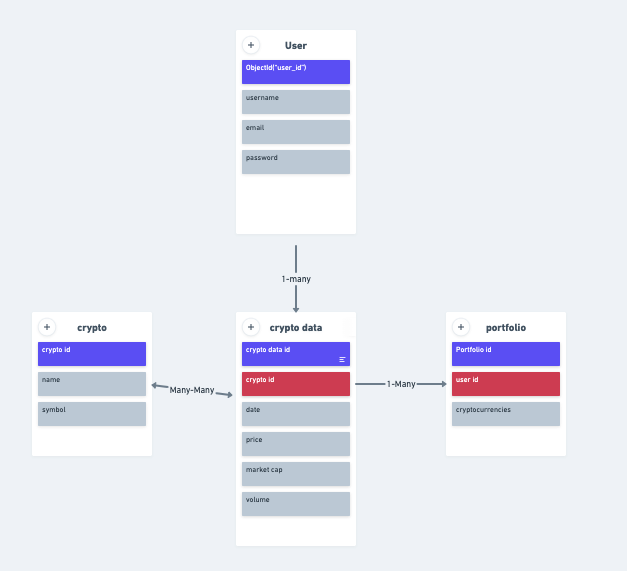

# Open-Note

## Date: 7/6/23

---

### **Developed By**

#### Will Certeza

#### [GitHub](https://github.com/wcerteza)

#### [Linked In](https://github.com/wcerteza)

---

### **_Description_**

#### "Open Note" is a cutting-edge note-taking app that combines the convenience of the MERN stack with the power of the OpenAI API. Users can create, organize, and manage their notes seamlessly while benefiting from the AI-powered summarization feature.

---

### **_Technologies_**

---

### **_Links_**

#### Deployed Application: [Open Note]()

#### [Trello](https://trello.com/b/NULXNmDc/open-note)

---

### **_Entity Relationship Diagram_**

### **_Component Hierarchy Diagram_**

### **_WireFrame_**

---

### **_Completed Website_**

---

### **_Production Goals_**

#### 1. Include a minimum of 3 Models, and have full CRUD operations on at least one of them.

#### 2. Implement User Authentication utilizing protected routes.

#### 3. Integrate with OpenAI API

---

### **_Future Goals_**

#### 1. Implement OAuth

#### 2. Develop additional features within Open Note, such as a personal/customizable chat bot to ask questions.

---

### **_Refrences_**

---
